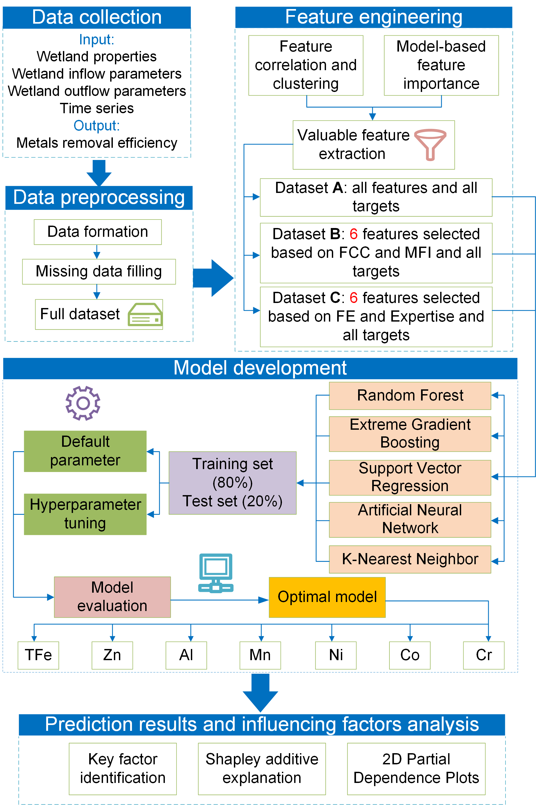

# ML+AMD+CWs — Machine Learning for Constructed Wetlands Treating Acid Mine Drainage

This repository contains the complete **reproducible workflow** for the research article:

> **Critical operational parameters for metal removal efficiency in acid mine drainage treated by constructed wetlands: An explainable machine learning approach**  
> *Jingkang Zhang, Xingjie Wang, Liyuan Ma, et al.*

We provide the primary end-to-end **Main pipeline** and a set of **Additional analyses** added to enhance transparency and robustness.

---

## Research Flowchart



*The figure illustrates the end-to-end process from raw data to interpretation.*

---

## What’s inside

```text
ML+AMD+CWs/
├─ Main pipeline/                         # Primary end-to-end workflow (+ its own README)
│  ├─ preprocess.py
│  ├─ feature_engineering.py
│  ├─ model_train.py
│  └─ interpret.py
│
├─ Additional analysis/                   # Supplemental studies (each script/dir is runnable)
│  ├─ imputation_order_sensitivity/       # 8 scripts + utils/ (shared helpers) + README
│  ├─ input_perturbation/                 # Input-perturbation sensitivity (3 scripts + README)
│  ├─ feature_importance_comparison.py    # Permutation / LIME / Occlusion
│  ├─ LOGO_cv_analysis.py                 # Leave-One-Group-Out across wetlands
│  └─ Missing_Value_Imputation_Model_Comparison.py  # Imputation model selection
│
├─ data/                                  # Place datasets here (not tracked by git if large/private)
│  ├─ initial_dataset.xlsx                # With missing values
│  ├─ full_dataset.xlsx                   # Fully imputed (created by preprocess.py)
│  └─ full_dataset_for_LOGO.xlsx          # Same as full_dataset + first column 'wetland_ID'
│
├─ outputs/                               # All run artifacts (ignored by git)
├─ reporting.py                           # Project-level result aggregator
├─ requirements.txt                       # Python dependencies
└─ README.md                              # This file
```

## Install dependencies

> Install dependencies first (Python 3.9+ recommended):  
> `pip install -r requirements.txt`

Optional extras used in some analyses: `xgboost`, `shap`, `lime`, `scipy` (scripts gracefully fall back or skip the method if an optional package is missing and record that in **meta**).

---

## Main pipeline (detailed overview)

The main workflow lives in **`Main pipeline/`**. It consists of four steps. Each script takes CLI arguments and uses **relative paths**. See the subfolder’s README for more examples.

### 1) Data preprocessing — `preprocess.py`
**Goal:** Clean the initial dataset and generate a standardized, fully-imputed file for downstream steps.

- **Inputs:** `data/initial_dataset.xlsx` (with missing values).  
- **Key operations:**  
  - Missing-value imputation (as implemented in the original study; preserves your logic).  
  - Abnormal/unused feature removal and dataset cleaning as applicable.   
- **Outputs:** `data/full_dataset.xlsx` (single source of truth for later steps).

**Command (from `Main pipeline/`):**
```bash
python preprocess.py --input ../data/initial_dataset.xlsx --outdir ../data --outfile full_dataset.xlsx
```

---

### 2) Feature engineering — `feature_engineering.py`
**Goal:** Explore feature relationships and prepare feature sets used in modeling.

- **Inputs:** `data/full_dataset.xlsx`  
- **Analyses & artifacts:**  
  - Correlation matrix (optionally **clustered** if SciPy is available).  
  - (Optional) hierarchical clustering **dendrogram** for input features.  
  - Global model-based **feature importance** (XGBoost “gain”; fallback to RandomForest if XGB is unavailable).  
  - Export three feature sets. 
  - Convenience tables with targets appended for A/B/C.  
- **Outputs:** `outputs/feature_engineering/` (e.g., `correlation_heatmap.png`, `feature_importance_global.xlsx`, `*_features_with_targets.xlsx`).

**Command:**
```bash
python feature_engineering.py --input ../data/full_dataset.xlsx --outdir ../outputs/feature_engineering
```

---

### 3) Model training — `model_train.py`
**Goal:** Train and evaluate multiple regressors across A/B/C feature sets.

- **Inputs:** `data/full_dataset.xlsx`  
- **Models:** XGB / RF / KNN / SVR / ANN (default fit + grid search per family).  
- **Per-target outputs:**  
  - **Predictions** and **metrics** (train/test R², RMSE, MAE).  
  - The **best model artifact** (`.joblib`) and a **prediction scatter plot**.  
- **Outputs:** `outputs/model_and_predict/{model, result}` (e.g., `result/all_metrics.xlsx`, `{SET}_{Target}_pred.xlsx`, `{SET}_{Target}_{Model}_{param}_scatter.png`).

**Command:**
```bash
python model_train.py --input ../data/full_dataset.xlsx --outdir ../outputs/model_and_predict --test_size 0.2 --seed 42
```

---

### 4) Interpretability — `interpret.py`
**Goal:** Explain model behavior with XGBoost, SHAP, and partial dependence (PDP).

- **Inputs:** `data/full_dataset.xlsx`  
- **Defaults:** Fixed **C** feature set — `i_pH,i_COD,day,i_EC,height,i_acidity`.  
- **Per-target outputs:**  
  - XGBoost **feature importances** (gain), **SHAP** summary plots.  
  - **PDP** (1D for each feature; 2D for feature pairs).  
- **Global outputs:** mean XGB importance across targets; combined SHAP summary.  
- **Outputs:** `outputs/interpretability/{imp_model, importances, shap, pdp}`.

**Command:**
```bash
python interpret.py --input ../data/full_dataset.xlsx --outdir ../outputs/interpretability --test_size 0.2 --seed 42
```

---

## Additional analyses (overview)

These studies extend robustness and transparency beyond the main pipeline.

### 1) Imputation-order sensitivity — `Additional analysis/imputation_order_sensitivity/`
**Question:** Does the **order** of imputation vs. data splitting cause leakage or bias?  
**What it does:** Groupwise/K-Fold/TimeSeries CV variants, baselines, multi-horizon analyses, with a shared `utils/`.  
**Data:** `data/initial_dataset.xlsx` (contains missing values).  
**Run:** See the subfolder’s README for exact commands.

### 2) Input-perturbation sensitivity — `Additional analysis/input_perturbation/`
**Question:** How sensitive are predictions to **multiplicative perturbations** of each input at inference time?  
**What it does:** Train once per target (XGB preferred), then on the **same test set** scale one feature at a time (e.g., ±10%) and recompute metrics. Includes Δ-heatmaps and per-target line plots.  
**Data:** `data/full_dataset.xlsx` (fully imputed).  
**Core run:**
```bash
# From: Additional analysis/input_perturbation
python input_perturb_sensitivity.py   --input ../../data/full_dataset.xlsx   --output ../../outputs/input_perturbation_sensitivity/results.xlsx   --scales 0.9,1.1 --grid
```

### 3) Comparative feature importance — `Additional analysis/feature_importance_comparison.py`
**Question:** Beyond XGB/SHAP, do other **model-agnostic** measures agree on what matters?  
**What it does:** Three methods per target on a fixed split: **Permutation Importance**, **LIME** (optional), **Occlusion** (set one feature to zero at inference; report ΔR²). Saves a global mean importance and optional bar plots.  
**Data:** `data/full_dataset.xlsx`.  
**Example:**
```bash
# From: Additional analysis/
python feature_importance_comparison.py   --input ../data/full_dataset.xlsx   --output ../outputs/feature_importance_comparison/results.xlsx   --features i_COD,i_pH,i_acidity,i_EC,day,height --grid --fig
```

### 4) Leave-One-Group-Out (LOGO) CV — `Additional analysis/LOGO_cv_analysis.py`
**Question:** Do models generalize across **wetlands** (groups)?  
**What it does:** For each left-out `wetland_ID`, train on the rest and evaluate on that group. Exports per-group R²/MAE and optional wide matrices.  
**Data:** `data/full_dataset_for_LOGO.xlsx` (includes first column `wetland_ID`).  
**Example:**
```bash
# From: Additional analysis/
python LOGO_cv_analysis.py   --input ../data/full_dataset_for_LOGO.xlsx   --output ../outputs/logo_cv/results.xlsx   --group_col wetland_ID --grid --save_wide
```

### 5) Missing-value imputation model comparison — `Additional analysis/Missing_Value_Imputation_Model_Comparison.py`
**Question:** Which **imputation model** is most suitable for the initial dataset?  
**What it does:** Compare several imputation strategies and export metrics to guide the preprocessing choice.  
**Data:** `data/initial_dataset.xlsx`.  
**Example:**
```bash
# From: Additional analysis/
python Missing_Value_Imputation_Model_Comparison.py   --input ../data/initial_dataset.xlsx   --output ../outputs/missing_value_imputation/results.xlsx
```

---

## Reporting (project-level)

`reporting.py` (at the repo root) aggregates results across the main pipeline and additional analyses. Example:

```bash
python reporting.py   --sources "./Main pipeline/../outputs" "./Additional analysis/**/outputs"   --out "./outputs/reporting"
```

---

## Citation

If you use this code or datasets, please cite the paper above. A BibTeX entry can be added here when available.

---

## License

This repository is released under the **MIT License**. See `LICENSE` for details.

---

## Contact

For questions or collaboration, please contact:
- Jingkang Zhang (倞康 张): zjk1202321889@cug.edu.cn
- Or open an issue on GitHub.

